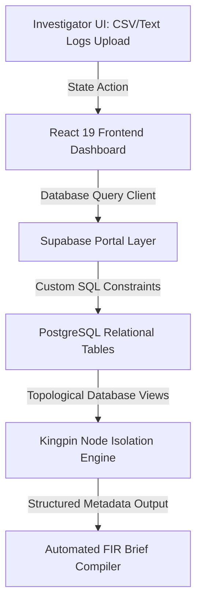

# 🏗️ Technical Architecture & Data Flow

### System Data Flow Matrix
The application uses a modern, high-performance web architecture to handle graph relations and structural state tracking securely.

### Component Responsibility Layout

| Architecture Layer | Technology Matrix | Primary Execution Responsibility |
| :--- | :--- | :--- |
| **User Interface Portal** | React 19 / Tailwind CSS | Handles secure asynchronous drop-zone uploads, UI dashboard layouts, and interactive graph interaction states. |
| **Relational Graph Core** | PostgreSQL / Supabase | Executes schema integrity guards and manages referential linking queries between device IDs and UPI paths. |
| **Development Validation** | IBM Bob CLI Ecosystem | Acts as a load-bearing SDLC partner to check type configurations, manage code consistency, and track template compliance. |
